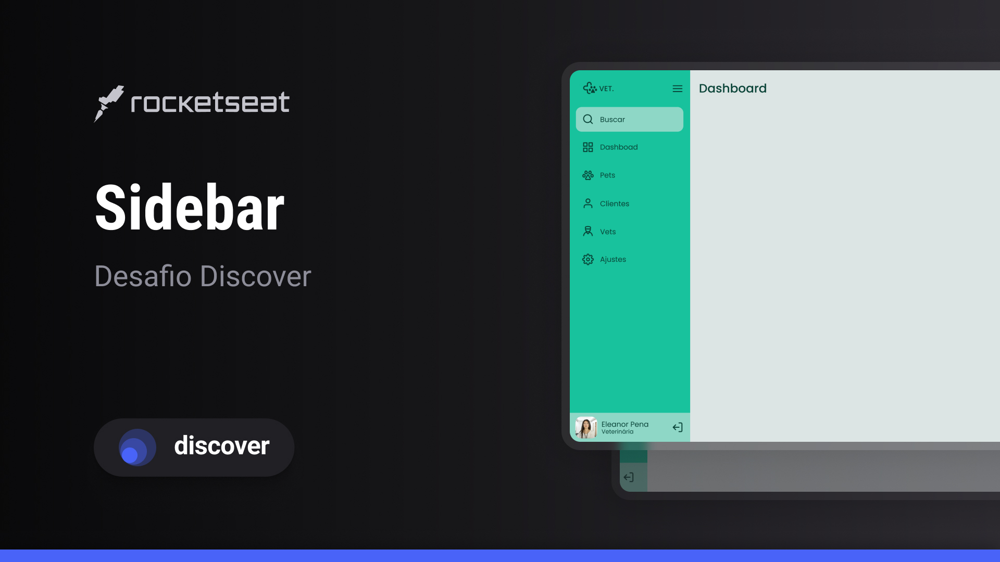

<h1 align="center"> Sidebar </h1>

Esse site foi desenvolvido como parte de um desafio elaborado pela Rocketseat no desenvolvimento de habilidades necessárias em um Web Developer.

  <a href="#-tecnologias">Tecnologias</a>&nbsp;&nbsp;&nbsp;|&nbsp;&nbsp;&nbsp;
  <a href="#-projeto">Projeto</a>&nbsp;&nbsp;&nbsp;|&nbsp;&nbsp;&nbsp;
  <a href="#-layout">Layout</a>&nbsp;&nbsp;&nbsp;|&nbsp;&nbsp;&nbsp;
  <a href="#memo-licença">Licença</a>

  

 

  

## 🚀 Tecnologias

Esse projeto foi desenvolvido com as seguintes tecnologias:

- HTML e CSS
- Javascript
- Git e Github
- Figma

## 💻 Projeto

O sidebar é um projeto complementar a um site completo.

- [Visite o projeto online](https://luad3cristal.github.io/sidebar)

## 🔖 Layout

Você pode visualizar o layout do projeto através [desse link](https://www.figma.com/file/eC8PXiYPE8ZDX2QPz7fDOO/Sidebar-%E2%80%A2-Desafio-Discover-(Community)?type=design&node-id=2204-99&mode=design&t=QhZPgePwDrFsaxcC-0). É necessário ter conta no [Figma](https://figma.com) para acessá-lo.

## 📝 Licença

Esse projeto está sob a licença MIT.